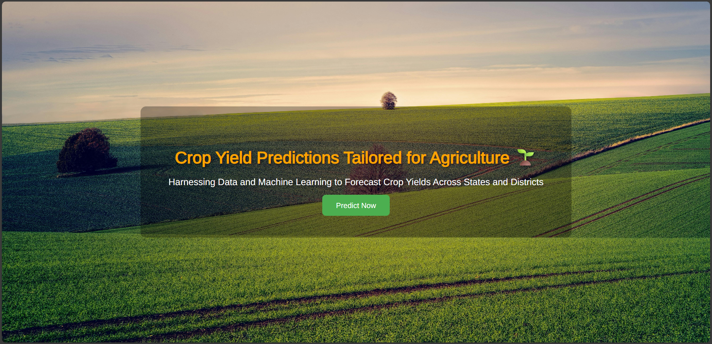
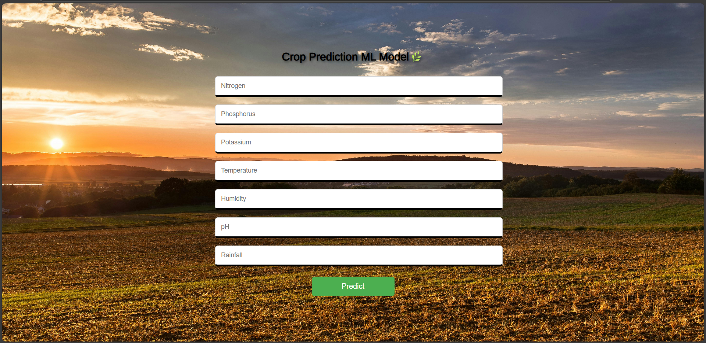
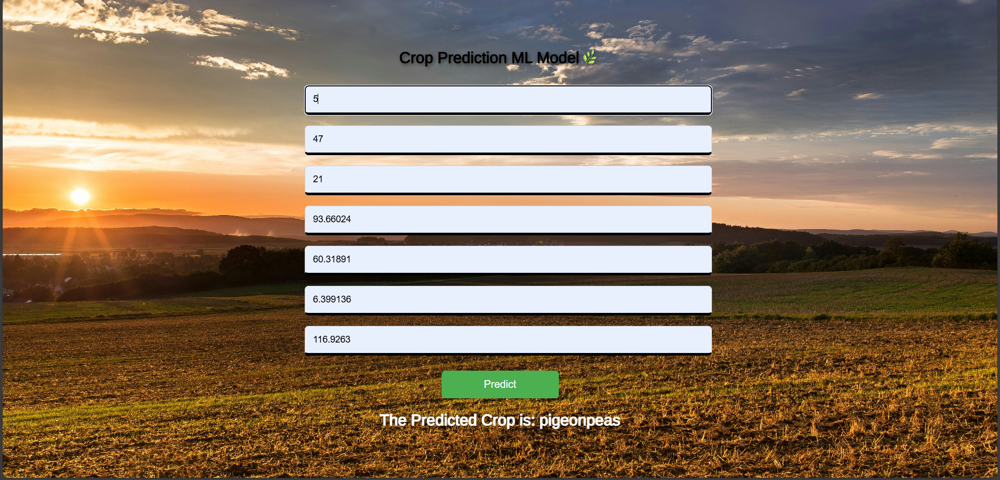

<h1 align="center">🌾 Crop Prediction ML Project</h1>

  <b>A Machine Learning project to predict suitable crops based on soil and environmental data.</b> 
  <i>Built with Python, Flask, and HTML/CSS, using a trained ML model.</i>

  
  
  
  
  

---

## 📄 About the Project
This ML project predicts the most suitable crop based on soil nutrients, temperature, and rainfall. Users can input environmental data through a simple web form, and the trained model returns the best crop recommendation.

---

## 📸 App Screenshot

*Figure 1: Crop Prediction App Dashboard*

*Figure 1: Crop selection info or instructions)*

*Figure 1: User submits soil/environment data)*

---

## 🚀 Live Demo
The app is deployed on **Render**:  
[Render Deployment Link Here](https://python-ml-crop-prediction-5.onrender.com/)
